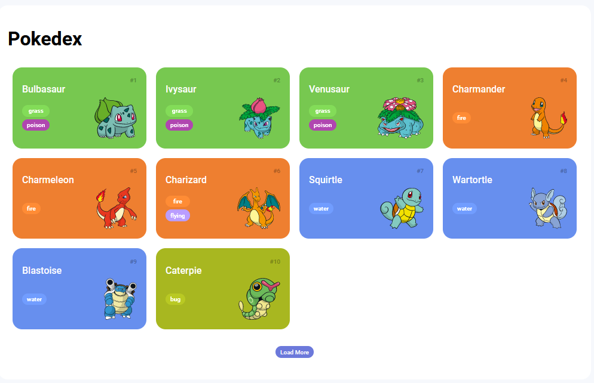
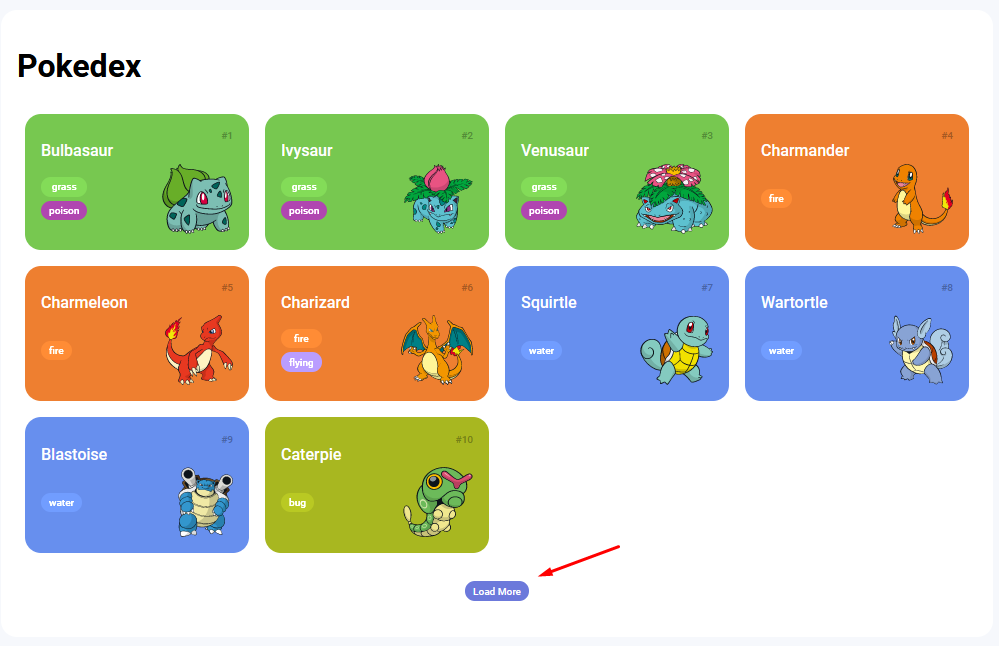
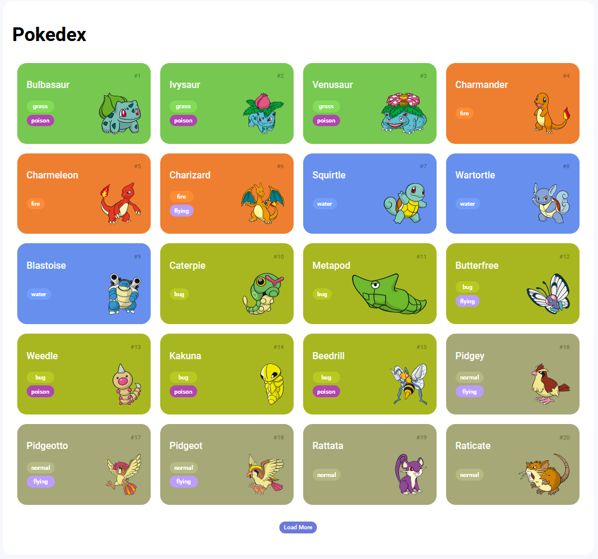

# Construindo uma Pokedex com JavaScript

## Descrição

Este é um projeto para o desafio de projeto **Construindo uma Pokédex com JavaScript** da DIO. Consiste em uma aplicação frontend que exibe os pokemons a partir de consulta realizada na API [PoKeApi](https://pokeapi.co/). Neste projeto é utilizado um servidor http estático simples chamado `http-server`.

## Pré-requisitos

* Node

## Tecnologias utilizadas

| Tecnologia  | Versão  |
| ----------- | ------- |
| Node        | 16.15.0 |
| Http-server | 14.1.1  |

## Comandos no terminal

```bash
# verificar versão do Node.js
node -v

# verificar versão do Npm
npm -v

# instalar http-server
npm install -g http-server

# subir o servidor http-server via terminal na pasta do projeto
# acessar em localhost:8080
http-server
```

## Adicionando o Normalize.css

* Site - <https://cdnjs.com/libraries/normalize>

```html
<link rel="stylesheet" href="https://cdnjs.cloudflare.com/ajax/libs/normalize/8.0.1/normalize.min.css" integrity="sha512-NhSC1YmyruXifcj/KFRWoC561YpHpc5Jtzgvbuzx5VozKpWvQ+4nXhPdFgmx8xqexRcpAglTj9sIBWINXa8x5w==" crossorigin="anonymous" referrerpolicy="no-referrer" />
```

## Adicionando a fonte Roboto

* Site - <https://fonts.google.com/specimen/Roboto?query=roboto>

HTML

```html
<link rel="preconnect" href="https://fonts.googleapis.com">
<link rel="preconnect" href="https://fonts.gstatic.com" crossorigin>
<link href="https://fonts.googleapis.com/css2?family=Roboto:wght@100;300;500;700&display=swap" rel="stylesheet">
```

CSS

```css
font-family: 'Roboto', sans-serif;
```

## Acessando a API

* Site - <https://pokeapi.co/>
* Endpoint - <https://pokeapi.co/api/v2/pokemon?offset=0&limit=10>

## Criando requisição com Fetch API

* Site - <https://developer.mozilla.org/en-US/docs/Web/API/Fetch_API>

## Acessando o Front-end

* Localhost - <http://localhost:8080>



Ao acessar o endpoint são exibidos os 10 primeiros pokemons.



Ao clicar no botão `Load More` são carregados mais 10 pokemons.



> Este projeto está configurado para exibir somente a primeira geração de Pokemons, totalizando 151 Pokemons.

The [MIT License](LICENSE) (MIT)
Copyright :copyright: 2022 - Projeto CRUD API com Spring Boot
